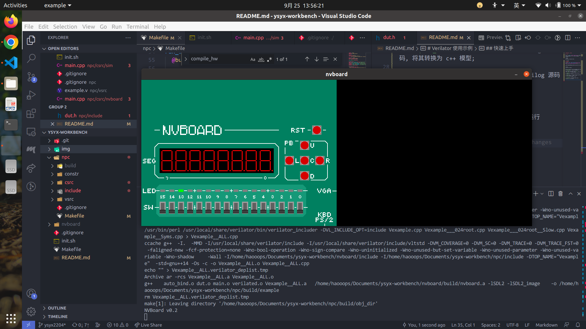

# Verilator 使用示例

## 简介

这是基于"[一生一芯](https://ysyx.oscc.cc/)"计划项目框架修改得到的仿真环境, 目的是帮助快速上手 Verilator. 

通过运行
```bash
bash init.sh subproject-name
```
进行初始化.

该项目在 Verilator 生成的 C++ 模型基础上构建了仿真测试对象的抽象 `Dut`, 源代码参考 `npc/csrc/lib/dut.cpp`. 该类提供了一系列接口方便编写仿真 testbench, 位于 `npc/csrc/sim/main.cpp`. 具体接口参考头文件 `npc/include/dut.h`.

## 目录结构

```
./
├── img
├── npc                   # 仿真源文件根目录
│   ├── constr            # nvboard 约束文件
│   ├── csrc              # 仿真 C++ 源代码
│   │   ├── lib
│   │   ├── nvboard
│   │   └── sim
│   ├── include
│   └── vsrc              # 仿真 Verilog 源代码
└── nvboard               # nvboard 项目根目录
    ├── board
    ├── build
    ├── example
    │   ├── build
    │   │   └── obj_dir
    │   ├── constr
    │   ├── csrc
    │   ├── resource
    │   └── vsrc
    ├── include
    ├── pic
    ├── scripts
    └── src
```

## 快速上手

请先参考["一生一芯"预学习阶段讲义](https://ysyx.oscc.cc/docs/prestudy/prestudy.html)构建基本开发环境.

使用该框架需要先克隆南京大学的 nvboard 项目, 具体方法为

```bash
bash init.sh nvboard
```

此外, 若使用的 shell 不是 bash, 需要手动设置环境变量 `NVBOARD_HOME` 为 nvboard 项目的根目录.

若要运行该项目, 需在 shell 中进入 `npc/` 目录, 然后使用 `make`, 目前支持的参数如下:

+ `compile_hw`: 使用 Verilator 编译 Verilog 源码, 将其转换为 C++ 模型;

+ `compile_sim`: 使用 Verilator 编译 Verilog 源码与仿真源码, 生成运行仿真的可执行程序;

+ `run_sim`: 运行仿真的可执行程序, 并在 `npc/` 目录下生成波形文件 `simx.vcd`;

+ `run_nvboard`: 在虚拟 FPGA nvboard 上运行 Verilog 设计. 运行效果如下(运行操作系统为 Ubuntu 20.04):



现象为 LED 灯由右至左依次亮起, 并不断循环.

## TODO

目前项目尚不支持用户便捷配置(如是否开启波形等), 后续考虑进一步完善.
